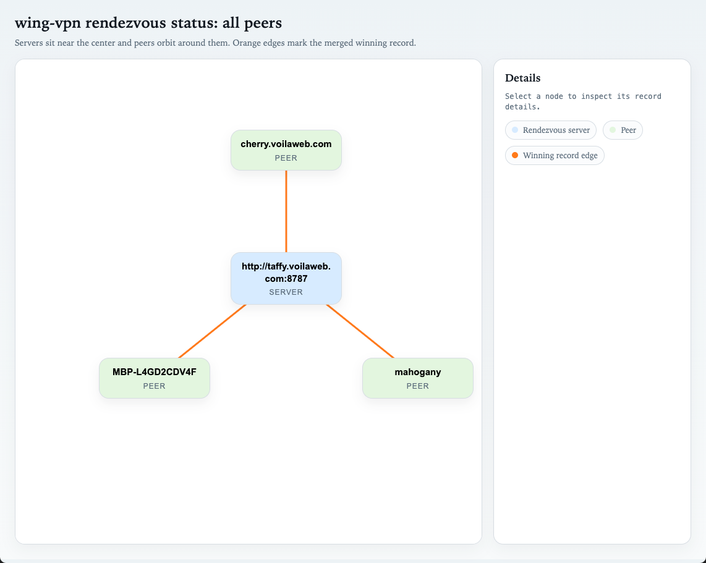

# wing

Dead‑simple WireGuard userspace launcher for Linux + macOS that keeps routes/DNS untouched. It’s designed to run on its own or alongside existing VPNs without disrupting their operations (see Non‑interference guarantees below).


## What it does
- Creates a dedicated WG interface via `wireguard-go` (userspace).
- Sets a local /32 address.
- Configures peers and **only** host (/32) routes for peer WG IPs.
- Does **not** touch default routes or DNS.
- Optionally runs a local control-plane daemon that publishes/fetches signed endpoint records through a rendezvous service.

## Requirements
- `wireguard-go` in `PATH`
- Linux: `ip` command (iproute2)
- macOS: `ifconfig` and `route`

On Linux, the kernel WireGuard driver is used automatically if available. `wireguard-go` is only needed when the kernel driver is missing.

WireGuard can run either in-kernel (fastest, preferred on Linux) or in userspace (`wireguard-go`, works everywhere but uses more CPU).

To confirm the Linux kernel driver is available, try `ip link add dev wgtest type wireguard` (should succeed), or `modprobe wireguard` followed by `lsmod | grep wireguard`.

If the kernel driver isn’t available, install `wireguard-go` and ensure it’s in `PATH` (Linux: `sudo apt install wireguard-go` or your distro’s equivalent; macOS: `brew install wireguard-go`).

Wing will use the kernel driver when it exists and fall back to userspace otherwise.

## Quick Walkthroughs

### Simple, a few peers tunneling
In this example, we are going to connect a couple peers. We could be connecting three or more just as easily.
This is a good setup for servers, or anyone who is not behind a NATted gateway, and not changing ip addresses too often.

Host A:
```sh
wing -setup
wing -export
```
copy exported peer definition

Host B:
```sh
wing -setup
wing -import
```
paste exported peer definition
```sh
wing -export
```
copy exported peer definition

Host A (again):
```sh
wing -import
```
paste exported peer definition

At any time, launch a leg of the peer relationship using:
```sh
sudo wing -detach
```

### With a control plane

Here, we setup one or more nodes as rendezvous registration and location nodes, and use stun for traversal.

<p align="center">
  
  <br>
  <em>wing -rendezvous-status all --graph</em>
</p>

The first thing we do is generate a root key pair. This will be used to sign control packages, preventing rogue peers from joining your network. Do not lose your private key!
```sh
wing -genrootkey
```

Now, for every peer that we "invite" to our network, we generate a new key control key pair:
```sh
wing -issuepeerkey -root-private-key <root private key>
```
-> this displays the peer's configuration: copy the output

then, on the corresponding peer, run
```sh
wing -setup
```
provide the required information; paste the above invite data when prompted.

We are now ready to build our network. Start one or more rendezvous nodes:
```sh
wing -serve-rendezvous -rendezvous-listen :8787 -rendezvous-trusted-roots <root public key> [-debug]
```

On each node, start wing in daemon mode and it will "call home:"
```sh
sudo wing -daemon
```

You can query the list of registered peers at any time:
```sh
wing -rendezvous-status all [--json|--graph]
```

## Usage
```sh
sudo wing [-config config.example.json]
```
If `-config` is not provided, wing will use `~/.wing/self.json` by default.
If the config file does not exist (either the default or a specified path), wing will create it with defaults (same as `-init`) and then exit.

Quick setup (interactive defaults):
```sh
wing -setup
```
Non-interactive setup:
```sh
wing -setup -address 10.7.0.1 -listen-port 51821 -mtu 1420
```
`-setup` also prompts for `my_endpoint` in `host:port` form, and will use the current value as the default.
It also prompts for rendezvous URLs as a comma-separated list.
It then asks whether you want to edit the issued rendezvous identity block. If you say yes, you can paste the `-issuepeerkey` output; if you paste one, it replaces the local `private_key` through `identity_signature` fields in `self.json`.
If you set a local `name`, that name is also published in rendezvous records so directory listings can show something human-readable.

List peers:
```sh
wing -list-peers
```
Add a peer (interactive):
```sh
wing -add-peer
```
Remove a peer (interactive):
```sh
wing -remove-peer
```
Export this node as a peer JSON block:
```sh
wing -export
```
Import a peer JSON block:
```sh
wing -import
```

If `wireguard-go` is installed but not in `PATH`:
```sh
sudo wing -wireguard-go /full/path/to/wireguard-go -config config.example.json
```
If your distro installs it as `wireguard`, you can point to that binary:
```sh
sudo wing -wireguard-go /full/path/to/wireguard -config config.example.json
```

Take down a lingering interface (Linux):
```sh
sudo wing -config config.example.json -down
```
Take down a lingering interface (macOS):
```sh
sudo wing -config config.example.json -down
# If auto-detection fails:
sudo wing -config config.example.json -down -os-iface utunX
```
Take down all interfaces created by wing (uses state files):
```sh
sudo wing -down-all
```

Show status:
```sh
wing -config config.example.json -status
```

Inspect rendezvous records for yourself or a peer:
```sh
wing -rendezvous-status self
wing -rendezvous-status all
wing -rendezvous-status peer-name
```

Run the local daemon:
```sh
sudo wing -daemon
```

Run the rendezvous service:
```sh
wing -serve-rendezvous -rendezvous-listen :8787 -rendezvous-trusted-roots ROOT_A_PUB,ROOT_B_PUB
```

Enable request/event logging on the rendezvous node:
```sh
wing -serve-rendezvous -debug -rendezvous-listen :8787 -rendezvous-trusted-roots ROOT_A_PUB,ROOT_B_PUB
```

Or load trusted roots from config:
```sh
wing -config rendezvous.json -serve-rendezvous
```

Return to prompt and leave the interface up:
```sh
sudo wing -config config.example.json -detach
# Use -down to tear it down later.
```

Generate keys without `wg`:
```sh
wing -genkey
wing -genrootkey
wing -issuepeerkey -root-private-key YOUR_BASE64_ROOT_PRIVATE_KEY
wing -genpsk
```

Root-issued peer flow:
```sh
# central secure location
wing -genrootkey
wing -issuepeerkey -root-private-key YOUR_BASE64_ROOT_PRIVATE_KEY
```

`-issuepeerkey` outputs a JSON bundle containing:
- `private_key`
- `public_key`
- `control_private_key`
- `control_public_key`
- `root_public_key`
- `identity_signature`

That bundle is what you distribute to the peer. The root signature binds the peer's WireGuard public key and control public key to the trusted root.

Linux without full root (userspace):
```sh
sudo setcap cap_net_admin,cap_net_raw+ep ./wing
wing -config config.example.json
```

## Config
`config.example.json` shows the shape. Only /32 IPv4 `allowed_ips` are accepted in this minimal version.

New control-plane fields:
- `control_private_key` / `control_public_key`: Ed25519 keypair used to sign endpoint records.
- `root_public_key` / `identity_signature`: root-issued identity proof binding the peer's WireGuard and control public keys to a trusted root signer.
- `name`: optional local node name published in rendezvous records and used as the default export name.
- `daemon.stun_servers`: STUN servers used for reflexive endpoint discovery.
- `rendezvous.urls`: HTTP base URLs for redundant rendezvous services.
- `rendezvous.trusted_root_public_keys`: root public keys that a rendezvous server will accept for peer registrations.
- `peer.control_public_key`: trusted signing key for a peer's dynamic endpoint records.
- `peer.root_public_key` / `peer.identity_signature`: root-issued proof for the peer identity bundle.
- `peer.dynamic_endpoint`: allow the daemon to replace the peer endpoint from rendezvous records.
- `-rendezvous-status`: query each configured rendezvous server directly and show the newest record it sees.
- `-rendezvous-status all`: list every currently registered peer each configured rendezvous server knows about, plus the merged newest set across servers.
  Those records now include the peer name, endpoint, and allowed IPs when the publishing node has them configured.
- `-genrootkey`: generate the trusted root signing keypair.
- `-issuepeerkey`: generate a peer identity bundle and sign it with the root private key.
- `-rendezvous-trusted-roots`: comma-separated root public keys trusted by `-serve-rendezvous`.
- `-debug`: when combined with `-serve-rendezvous`, log registrations, lookup hits/misses, rejections, and record summaries.

## Debugging

So, is WireGuard not cooperating? Or is it?

The most common issue is forgetting to import the remote node on both peers.


## Notes
- macOS: `wireguard-go` creates a `utunX` interface. This tool detects the **newly created** `utun` and configures it. Don’t start multiple `wireguard-go` instances at the same time.
- `-reuse` is supported on Linux only; macOS cannot reliably map an existing WG device to a `utunX` interface.
- For a mesh, each node lists the other peers with their WG IPs and endpoints.
- Wing stores state files under `~/.wing` (or `WING_STATE_DIR`) for `-down-all`.
- `-down-all` only affects interfaces that were created by wing (state files are written only when wing creates a device).
- `-init` writes `~/.wing/self.json` and includes `public_key` for sharing with peers.
- `-daemon` is intended to run under launchd/systemd or another service manager; it stays in the foreground.
- STUN discovery is best-effort. On the first daemon start it probes using the configured WG port; later refreshes may publish a guessed port if the live WG socket already owns the port.
- With multiple rendezvous servers configured, the daemon publishes to all of them and accepts the newest valid signed record it can fetch from the set.
- Redundant rendezvous fetches are done in parallel with a short timeout window, so one slow server does not hold up fresher records from faster ones.
- `-serve-rendezvous` now rejects records unless they carry a root-issued identity signed by one of the configured trusted roots, and it rejects attempts to replace an existing peer slot with a different identity binding.

## Non‑interference guarantees
- No default route changes.
- No DNS changes.
- Only a dedicated WG interface is created and host routes are added for peer WG IPs.
